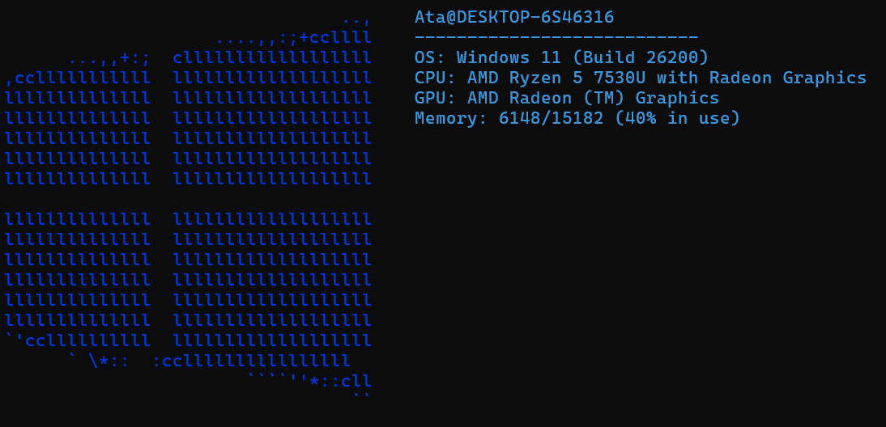

# sysfetch 🖥️

A lightweight, fast system information tool for Windows written in C++, inspired by neofetch.

## Preview



## Features

- OS version (Windows 10/11)
- CPU name and core count
- GPU name
- RAM usage
- System uptime
- Computer and username

## Build

Requirements: CMake, MinGW (C++17 or later)

```bash
git clone https://github.com/ataataataataata/sysfetch.git
cd sysfetch
cmake .
cmake --build .
```

## Usage

```bash
sysfetch
```

## License

MIT
